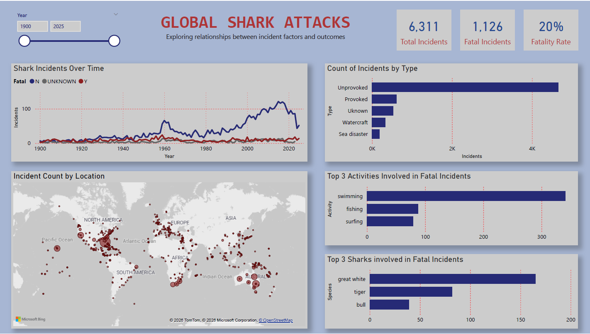

# Shark Attack Risk Analysis

## Overview
This project analyzes the Global Shark Attack File ([GSAF](https://www.sharkattackfile.net/incidentlog.htm)) data to identify key patterns in shark encounters with fatal outcomes. These insights are then leveraged to build a machine learning model to predict the likelihood of a fatal result in the event of a shark attack.

## Project Workflow
1. Raw data ingestion
2. Data cleaning and transformation
3. Exploratory data analysis and visualization
4. Machine learning model training and evaluation
5. Final reporting and project reflection
6. Project walkthrough video

## Tools Used
- **Power BI** – exploratory data analysis and visualizations via interactive dashboard
- **Python** – data manipulation and analysis (NumPy, pandas, matplotlib, scikit-learn)
- **Jupyter Notebook** – data cleaning and machine learning model development

## Dashboard Preview

## Data Cleaning Decisions
- **Incident Type:** labels were standardized into five categories
- **Age:** Missing age indicator was created, missing values were imputed using the median
- **Species, Activity and Country:** Columns were consolidated into their most frequent categories (16, 10, and 15 respectively), with remaining values grouped into ‘Other’ or ‘Unknown’

## Key Insights
- Certain activities occurred more frequently in fatal shark incidents
- A few specific shark species were associated with a higher proportion of fatal attacks
- Incident counts were highly concentrated in a small number of geographic locations

## ML Results
- **Models Considered:** Logistic Regression, Decision Tree Classifier, Support Vector Classifier
- **Final Model:** SVC
- **Primary Metric:** Recall = 90% (high cost of false negatives)
- See [Model Card](reports/model_card.pdf)

## How to View
1. Watch the project [walkthrough video](https://youtu.be/fX_Eqg9OXxA)
2. Download the [interactive dashboard](powerbi/shark_attack_dashboard.pbix) and open in Power BI Desktop  
3. View [notebooks](notebooks) directly on GitHub  
4. Read the [written responses PDF](reports/written_responses.pdf)

## Dataset Source
- Global Shark Attack File: [GSAF Incident Log](https://www.sharkattackfile.net/incidentlog.htm)
